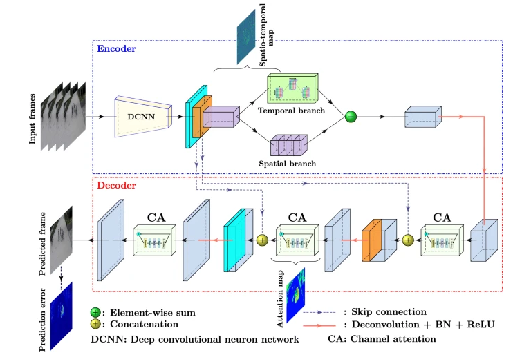
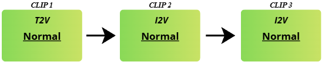
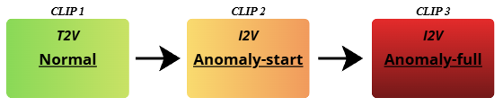
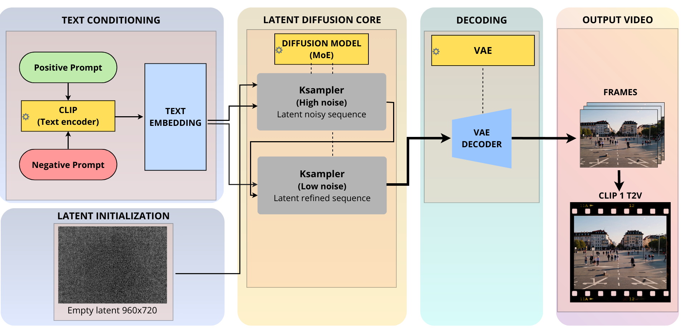
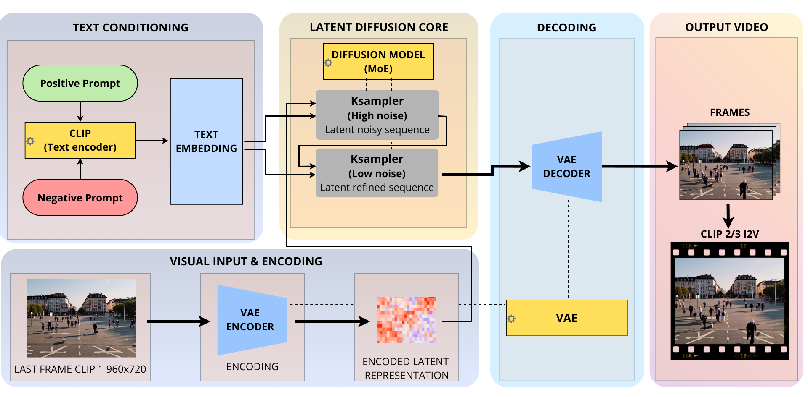

# Synthetic Data Augmentation for Crowd Anomaly Detection

### Bachelor Thesis - Applied Computer Science and Data Analytics
**University of Cagliari**

This thesis project was supervised by professors from the University of Cagliari within the research framework of **PRALab** and **SAIFer Lab**. The study investigates the transition from synthetic environments to real-world applications, aiming to improve the robustness of AI models for crowd anomaly detection.

---

## Architecture & Pipelines

The experiments are based on the **ASTNet** detector. Base detector implementation: [ASTNet Fork](https://github.com/marco-caruso/astnet).

### Detector Architecture

*Figure 1: ASTNet detector architecture.*

### General Video Generation Pipelines
Workflows detailing how normal and anomalous video sequences were created.

| Normal Video Pipeline | Anomalous Video Pipeline |
| :---: | :---: |
|  |  |
| *General pipeline for normal events* | *General pipeline for anomalous events* |

### Specific Generation Pipelines (Text-to-Video & Image-to-Video)
Detailed generative pipelines used for creating the synthetic sequences.

| Text-to-Video Pipeline | Image-to-Video Pipeline |
| :---: | :---: |
|  |  |
| *Text-to-Video generation workflow* | *Image-to-Video generation workflow* |

---

## Experimental Model Checkpoints

The pretrained model checkpoints used in the experiments are available at the following link:
🔗 [Google Drive - Model Checkpoints (.pth)](https://drive.google.com/drive/folders/1DPkrXN5gMHFswe7lUv7VB_tgj7VedPeS?usp=drive_link)

These `.pth` files contain the trained weights for the models used in the experiments. The models correspond to the configurations listed below:

* `training_ped2`: training with 100% ped2
* `training_synth`: training with 100% synthetic (114 random videos)
* `training_ped2_synth`: training with 50% ped2 / 50% synthetic (manual selection)
* `training_ped2_synth_random`: training with 50% ped2 / 50% synthetic (random selection)
* `training_ped2_synth_2`: training with 75% ped2 / 25% synthetic (manual selection)
* `training_ped2_synth_2_random`: training with 75% ped2 / 25% synthetic (random selection)
* `training_ped2_synth_3`: training with 90% ped2 / 10% synthetic (manual selection)
* `training_ped2_synth_3_random`: training with 90% ped2 / 10% synthetic (random selection)

---

## Synthetic Dataset

To augment the training data, a synthetic crowd dataset was generated using the **WAN 2.2 14B** video diffusion model, producing crowd scenes used to augment the training data.

🔗 [Download Synthetic Dataset (Google Drive)](https://drive.google.com/drive/folders/1kc7W18yDGC11MskBfprX4YQMBns6bIou?usp=drive_link)

The dataset consists of **284 videos**, each lasting 15 seconds at 16 FPS (243 frames), equally divided into:
* **142 normal videos**
* **142 anomalous videos**

The anomalous sequences are categorized into three macro classes:
1. General panic events
2. Fights and assaults
3. Suspicious object scenarios

All sequences were generated across four different environmental contexts designed to simulate common surveillance environments:
* Simple public squares
* Public squares with urban furniture and seated pedestrians
* Public squares surrounded by buildings
* Train station

### Dataset Structure
```text
synthetic_dataset/
├── anomalous/
├── normal/
└── README.txt
